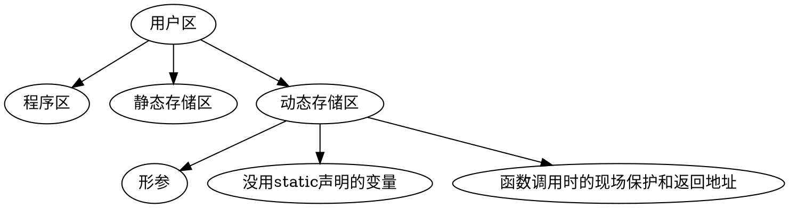
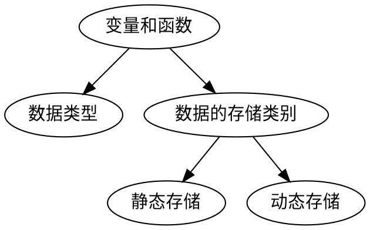

<!--
 * @Email: muxxs@foxmail.com
 * @Auther: Muxxs
 -->

# 函数

`函数类型 函数名(参数类型 参数名)`

* 函数类型<->return的类型
* 函数若不返回，函数类型为void
* 若无参数，参数名处为void
* 若函数在被调用处之后，应先声明函数

## 1.嵌套调用

```
int main(){
    print("%d",max(1,2,3,4)); //起点
    return 0;
}

int max4(int a,int b,int c,int d){
    int max2(int a,int b); //->此处max2在max4后面，需要声明
    m=max2(a,b);
    m=max2(m,c);
    m=max2(m,d);
    return m;
}
int max2(int a,int b){
    if (a>b){
        return a;
    }else{
        return b;
    }
}
```

## 2.递归调用

**我调用我自己**

这种情况下每次循环都会被暂存到内存中，空间复杂度较大

```
int f(int x){
    int y,z;
    printf(x);
    z=f(y);
    return (2*z);
}
```
比如这个，会自己调用自己

```flow

st=>start: Start
op1=>operation: f ( x )
e=>operation: Operation

st->op1->e->op1

```
**无 限 套 娃**

## 3.数组作为函数参数

`Example:`

`int max(x[10])`

也可以不指定数组的大小

`int max(x[])`

**多维数组**

类比上面

`int max(x[][3])`

## 4.局部变量和全局变量

局部变量：`函数体内定义的变量`

`Example:`
```
float f1(int a){
    int b,c; -> b和c为局部变量
    ...
}
```

全局变量：`函数体外定义的变量`

`Example:`
```
int d=10; //d->全局变量
float f1(int a){
    int b,c; //-> b和c为局部变量
    ...
}
```

## 5. 变量的存储方式和生存期

---



**1. 局部变量的存储类别**
* 自动变量
    `auto 变量类型 变量名;`
    
    **不写auto则隐含指定为“自动存储类别”**

    调用时系统分配存储空间，调用结束时释放空间


* 静态局部变量(static 局部变量)
    `static 变量类型 变量名`
    静态局部变量在调用后不释放，仍保留原来的值
    一直保留到程序运行结束
    **下次static的时候不赋值，保留上次的值**

* 寄存器变量(register 变量)
    `register 变量类型 变量名`
    这种变量是存储在寄存器当中的(速度比较快，但是不知道为啥不用了)

**2. 全局变量的存储类别**

1. 一个文件内扩展外部变量作用域 & 将外部变量的作用域扩展到其他文件
    `extern 变量名`
    扩展后可正常使用

2. 将外部变量作用域限制在本文件中
    `static 变量类型 变量名`

**小结**

```dot
digraph main{
    按照作用域 -> 局部变量
    按照作用域 -> 全局变量
    局部变量 -> 自动变量
    局部变量 -> 静态局部变量
    局部变量 -> 寄存器变量
    全局变量 -> 静态外部变量
    全局变量 -> 外部变量
}