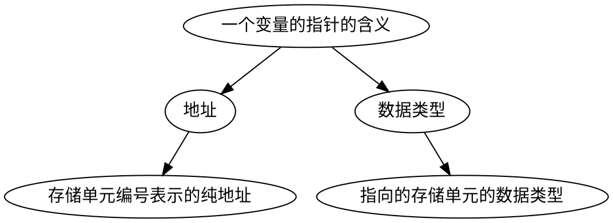

<!--
 * @Email: muxxs@foxmail.com
 * @Auther: Muxxs
 -->
<!--
 * @Email: muxxs@foxmail.com
 * @Auther: Muxxs
 -->

# 指针

## 指针变量定义

`类型名 *指针变量名`

类型名是必须指定的`基类型`，确定指针变量可以指向的变量的类型。



初始化：

```
float * pointer=&a
```

## 指针变量的使用

1. 给指针变量赋值

    `p=&a`
    将a的地址赋给指针变量p

2. 引用指针变量指向的变量

    `printf("%d",*p)`
    打印指针变量p所指向的变量

3. 引用指针变量的值

    `printf("%o",p)`
    以八进制数形式输出指针变量p的值

* `&` 取地址运算符 &a是变量a的地址
* `*` 指针运算符 如*p表示指针变量p指向的对象

## 指针变量作为函数参数

`void swap(int *p1, int *p2)`
